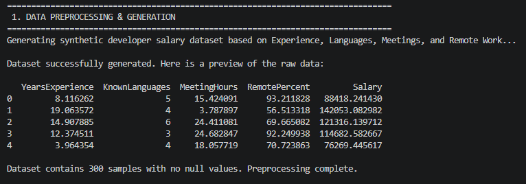
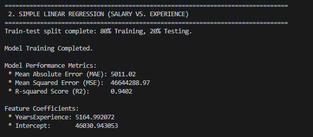
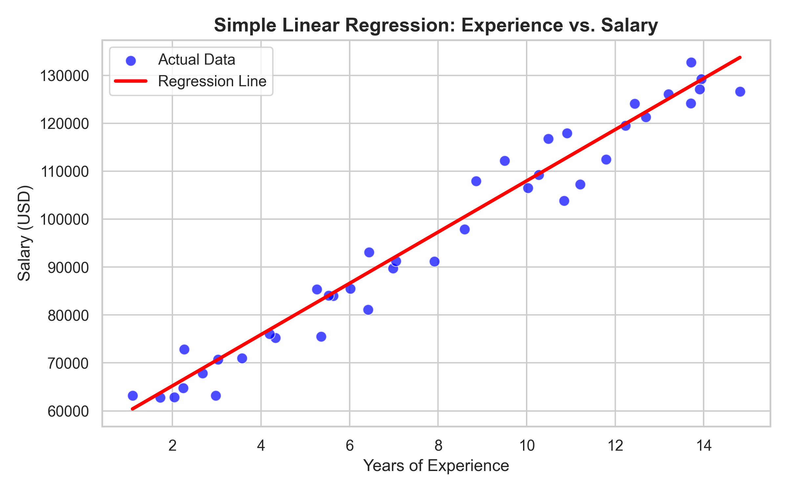
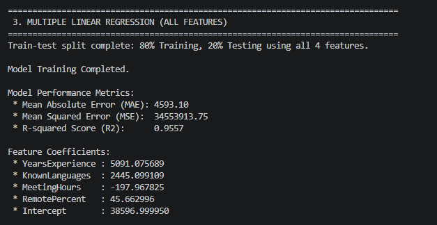
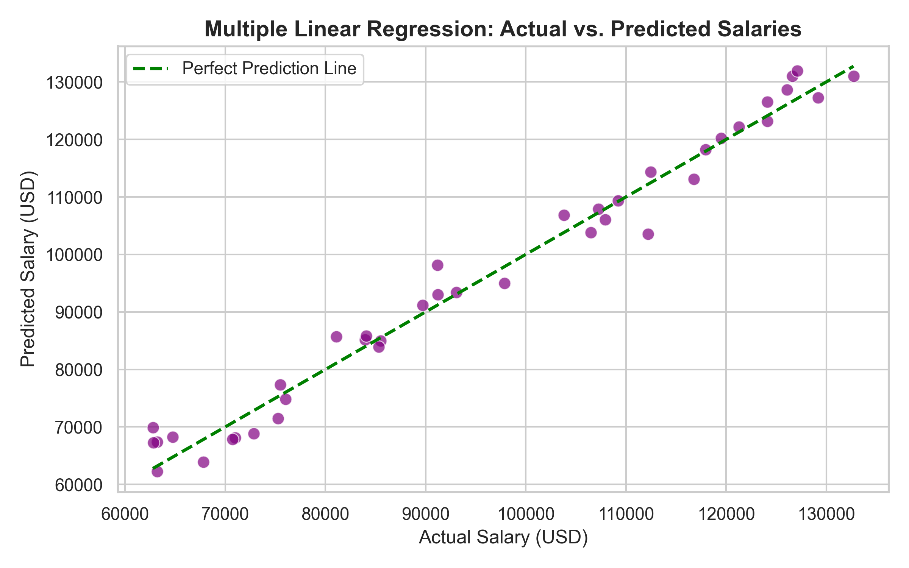
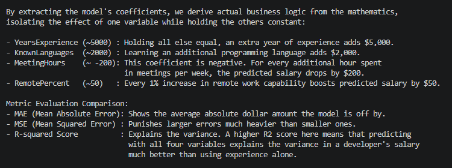

# Task-3 💻 Developer Salaries & Tech Market Analytics
## Project Overview

This project implements a Machine Learning pipeline using **Linear Regression** to predict developer salaries based on market data. The objective is to understand how different variables (like years of experience, known programming languages, meeting hours, and remote work percentage) impact annual compensation and to build a predictive model evaluating these relationships.

Through this project, I practically explored Simple vs. Multiple Linear Regression, generated synthetic datasets representing tech market variables, and interpreted model coefficients to extract actual business logic.

## Technologies & Libraries Used

* **Python 3.x**
* **Pandas & NumPy**: Data generation, preprocessing, and manipulation
* **Scikit-Learn (sklearn)**: Model building, train-test splitting, and performance evaluation metrics (MAE, MSE, $R^2$)
* **Matplotlib & Seaborn**: Data visualization and regression line plotting

## Pipeline Steps & Key Insights

### 1. Data Preprocessing & Generation

The dataset was generated synthetically to represent realistic tech market variables. The features include `YearsExperience`, `KnownLanguages`, `MeetingHours`, and `RemotePercent`. 

### 2. Simple Linear Regression (Salary vs. Experience)

First, a Simple Linear Regression model was trained to establish the baseline relationship between a single feature (**Years of Experience**) and the target variable (**Salary**).

The graph below plots the actual developer salaries against their years of experience, with the red line representing our model's "line of best fit."

🔍 Chart Breakdown:
- A scatterplot featuring blue dots representing the testing data (actual developer 
  salaries plotted against their years of experience).
- A solid red line passing through the center of the data cluster. This is the 
  "line of best fit." It represents our mathematical model's attempt to draw a 
  relationship between experience and money with the lowest possible error.

### 3. Multiple Linear Regression (All Features)

To achieve a more accurate prediction, a Multiple Linear Regression model was implemented incorporating all available features. The data was split into 80% Training and 20% Testing sets.

Since we are predicting using four dimensions, the graph compares the **Actual Salaries** against the **Predicted Salaries**. The closer the data points cluster to the dotted green diagonal line (Perfect Prediction), the more accurate the model is.

🔍 Chart Breakdown:
- Because we are predicting using four dimensions, we cannot draw a simple line on a 2D graph.
- Instead, you will see a scatter plot comparing Actual Salaries (X-axis) against 
  Predicted Salaries (Y-axis). 
- There is a dotted black diagonal line representing "Perfect Prediction" (Actual = Predicted). 
  The closer our purple data points cluster to this diagonal line, the more accurate the model is.

### 4. Interpreting Feature Coefficients

By extracting the model's coefficients, I derived actual business logic from the mathematics:

